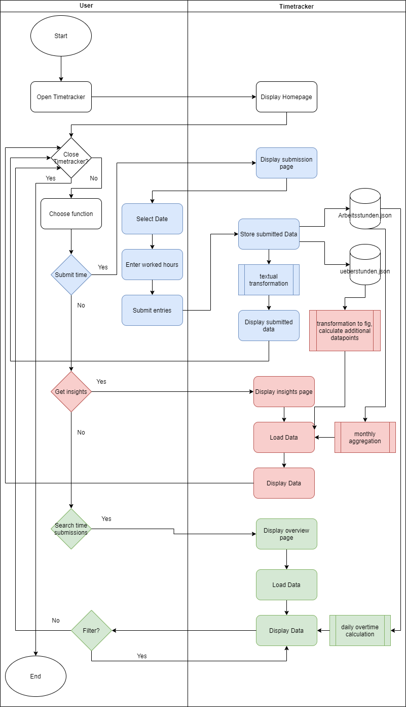

<h1>Working hours tracker 2021</h1>

<h2>Quick Project description</h2>
The user will enter their working hours and the data will be stored. The data will then be checked against the official working hours (8 hours) and over/undertime will be calculated. The user will get an overview how many hours he worked per day and get a report how much over- or undertime he currently has.
The programm will also include a possibility to see when the user usually generates over- or undertime by using plotly visualization.

<h3>Functions: </h3>
1. User working hour entries  - DONE   
   1.1 Daily overview (current date)   - DONE   
2. Official working hours store  - DONE stored in JSON   
3. User working and official hours check  - DONE  
    3.1. Print over or undertime - DONE  
5. Print on which days most over- undertime is generated  - Reduced to specific day - DONE  
6. Visualize data - DONE - Visualizing in Chart format and Plot for overtime

<h3>Step by step Frontend / Functionalities:</h3>

Homepage:
1. User opens webapp
2. User sees functions to choose  
   2.1 Time submission - DONE  
   2.2 Working hours insight - DONE  
   2.3 Day by Day overview - DONE  
3. User chooses desired function   

Submit Time: - DONE  
1. User sees fields with Date and a text field to enter an amount of hours in the middle and a submit button on the right   - DONE  
2. User enters hours worked to associated date in the text field   - DONE  
3. User presses the submit button  - DONE  

Insight: - DONE  
1. User sees multiple charts  - Changed to single graphical chart and table variant for clarity - DONE     
    1.1 Total hours worked - DONE    
      1.1.1 option to filter by week, month, year - DONE in Day by Day overview   
    2.2 Overtime  
        2.2.1 Total overtime - DONE    
        2.2.2 Overtime occurence  - DONE Plotly viz.
            2.2.2.1 Per Week of Year, Per Month of Year, Per Day of Week - Restricted to Daily, Monthly and Yearly overview - DONE

Day by Day overview: - DONE
1. User sees an overview over his amount worked associated to the specific date - DONE
2. User sees overtime/undertime highlighted - DONE

<h2> Installation guide  </h2>
Make sure you have following extensions installed:  

Flask  - https://flask.palletsprojects.com/en/2.0.x/installation/  
WTForms  - https://wtforms.readthedocs.io/en/2.3.x/  
Plotly  - https://plotly.com/python/getting-started/

For the purpose of this project some data entries are already provided in dictionary format in Hours/arbeitsstunden.json 
and Hours/ueberstunden.json. If you want to create your own Working hours 2021 report make sure to delete all entries in the respective files and provide a clean dictionary -> { }

<h2>Functionality Flowchart</h2>

